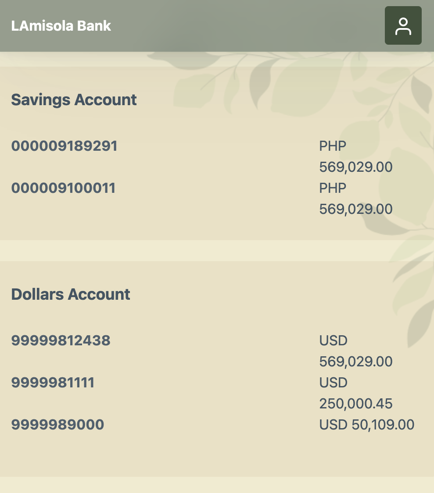

# lamisola_bank

A fictional banking application that demonstrates micro-frontend using Single-SPA framework.

**Organization**: 
	lamisola-banking-group

**Application names**:

- lamisola-bank-app ( root-config, port: 9000 )
- header-mfe ( port:  9005 )
- dashboard-mfe ( port: 9010 )

**Definition of done**

- All MFEs are integrated in the main app. User can navigate from different pages.
- Header-mfe is consumable in different MFEs once it is needed.
- CSS is available through all MFEs.



## lamisola-bank-app

Create a new Single-SPA project. Type *create-single-spa* in the terminal.

```
npx create-single-spa
```

Supply the following questions using the answers below. 

```
? Directory for new project lamisola-bank-app

? Select type to generate single-spa root config

? Which package manager do you want to use? npm

? Will this project use Typescript? No

? Would you like to use single-spa Layout Engine Yes

? Organization name** (can use letters, numbers, dash or underscore) lamisola-banking-group
```

Type *npm start* in the terminal to boot up your single-spa root config.

```
npm start
```

## dashboard-mfe

Start creating single-spa application, by typing *create-single-spa* inside the terminal.

```
npx create-single-spa@4.1.3
```

Supply the following questions using the below answers.

```
? Directory for new project dashboard-mfe

? Select type to generate single-spa application / parcel

? Which framework do you want to use? react

? Which package manager do you want to use? npm

? Will this project use Typescript? No

? Organization name (can use letters, numbers, dash or underscore) lamisola-banking-group

? Project name (can use letters, numbers, dash or underscore) dashboard-mfe
```

Run the application.

```
npm start -- --port 9010
```

## header-mfe

Create a single-spa project

```
npx create-single-spa@4.1.3
```

Create a new directory. Select *single-spa application / parcel* and use *React* as a framework for this project.

```
? Directory for new project header-mfe

? Select type to generate single-spa application / parcel

? Which framework do you want to use? react

? Which package manager do you want to use? npm

? Will this project use Typescript? No

? Organization name** (can use letters, numbers, dash or underscore) lamisola-banking-group

? Project name (can use letters, numbers, dash or underscore) header-mfe
```

Run the application

```
npm start -- --port 9005
```

## Consume header-mfe as a parcel in dashboard-mfe

Import Parcel in dashboard-mfe's root.component.js

```
import Parcel from 'single-spa-react/parcel';
```

Then add Parcel inside the root function of the root.component.js.

```
export default function Root(props) {
	return (
		<div>
			<Parcel config={() => System.import("@lamisola-banking-group/header-mfe")} />
	...
```

## Integrate all MFEs in the main application

Define all MFEs inside the index.ejs of lamisola-bank-app.

```
<% if (isLocal) { %>
<script type="systemjs-importmap">
	{
		"imports": {

			"@single-spa/welcome": "https://unpkg.com/single-spa-welcome/dist/single-spa-welcome.js",

			"@lamisola-banking-group/root-config": "//localhost:9000/lamisola-banking-group-root-config.js",

			"react": "https://unpkg.com/react@17.0.2/umd/react.production.min.js",

			"react-dom": "https://unpkg.com/react-dom@17.0.2/umd/react-dom.production.min.js",

			"@lamisola-banking-group/header-mfe": "//localhost:9011/lamisola-banking-group-header-mfe.js",

			"@lamisola-banking-group/dashboard-mfe": "//localhost:9010/lamisola-banking-group-dashboard-mfe.js"

		}
	}
</script>
<% } %>
```

Make sure to run all the applications.

```
//header-mfe
npm i
npm start -- --port 9005

npm i
//dashboard-mfe
npm start -- --port 9010

npm i
//lamisola-bank-app
npm start
```

